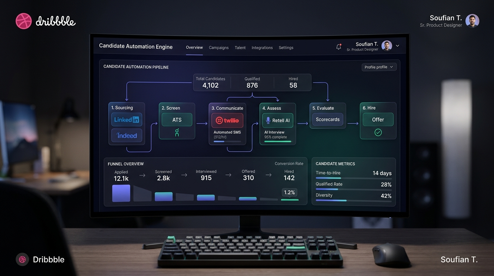
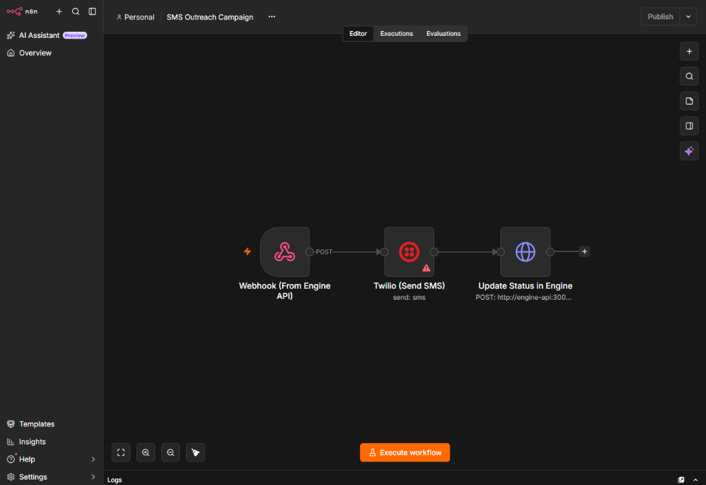
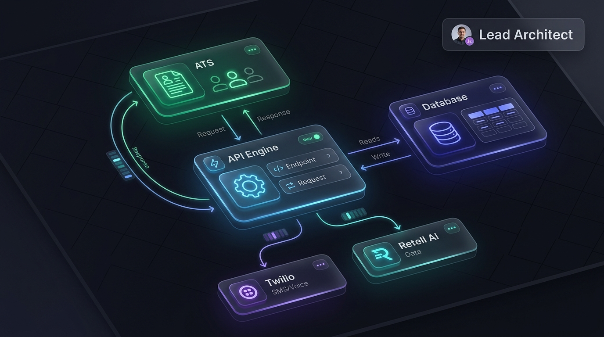
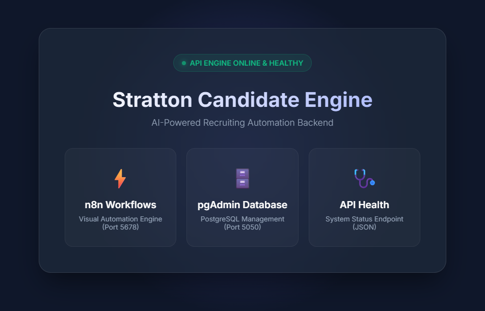

# 🚀 Stratton Candidate Engine
**AI-Powered Recruitment Automation & Outreach System**

---

## 📖 Project Overview

The **Stratton Candidate Engine** is a highly scalable, multi-tenant backend automation system designed specifically for modern staffing and recruitment agencies. 

It eliminates manual data entry and candidate outreach by seamlessly connecting a staffing agency's existing ATS (Applicant Tracking System) with powerful communication tools (Twilio for SMS, Retell AI for Voice) using visually orchestrated workflows in **n8n**.

---

## 🧠 Detailed System Workflow (How it Works)

Our system acts as a "Ghost Employee" that works 24/7 in the background. Here is the exact flow of data:

1. **Data Ingestion (ATS Integration)**
   - The system connects to the client's ATS (e.g., Bullhorn, Avionté, Salesforce) via REST APIs.
   - When a recruiter creates a new *Job Order*, our Node.js API detects it and instantly pulls a list of matching candidates.

2. **Deduplication Engine (Redis)**
   - Before any message is sent, the candidate's ID is checked against a high-performance **Redis** cache.
   - This guarantees **100% Idempotency**—meaning a candidate will *never* receive duplicate calls or messages, even if the system restarts.

3. **Visual Workflow Orchestration (n8n)**
   - The API triggers an internal Webhook to **n8n**.
   - n8n acts as the visual brain, routing the candidate through a customized outreach tree.

   

4. **Omnichannel Outreach (Twilio & Retell AI)**
   - **Phase 1 (SMS):** The candidate receives a personalized text message via **Twilio** asking if they are available for a new role.
   - **Phase 2 (AI Voice):** If the candidate shows interest, **Retell AI** initiates a human-like voice call to conduct a preliminary screening interview.

5. **State Management & Database Sync**
   - Every interaction, response, and call transcript is logged into a central **PostgreSQL** database.
   - If a candidate replies "STOP" (Opt-out), the system instantly halts all future sequences.

6. **ATS Write-back & Scheduling**
   - Once a candidate is qualified, the Node.js Engine writes the interview notes and status directly back into the client's ATS.
   - Finally, it connects to Google Calendar/Microsoft 365 to seamlessly book an interview slot for the human recruiter.

---

## 🏛️ System Architecture

The architecture is heavily decoupled, ensuring massive scalability and the ability to onboard new clients without rewriting core logic.

### Core Technologies
- **Backend Engine:** Node.js, Express.js
- **Database:** PostgreSQL (State), Redis (Queue & Deduplication)
- **Automation Node:** n8n (Self-hosted)
- **Communications:** Twilio API, Retell AI API
- **Infrastructure:** Docker & Docker Compose

---

## 🎛️ Control Center (Dashboard)

To monitor the health of the API and workflows, the system features a sleek, secure local dashboard monitoring the PostgreSQL database and n8n engines.

---

### 💼 Hire Me

Are you a recruitment agency looking to automate your pipeline? Or a business needing robust backend architecture?
**Let's build something extraordinary.**

**Email:** souf.taytay@gmail.com | **WhatsApp:** +971 56 601 8835 | **LinkedIn:** [taysouf](https://www.linkedin.com/in/taysouf/)

