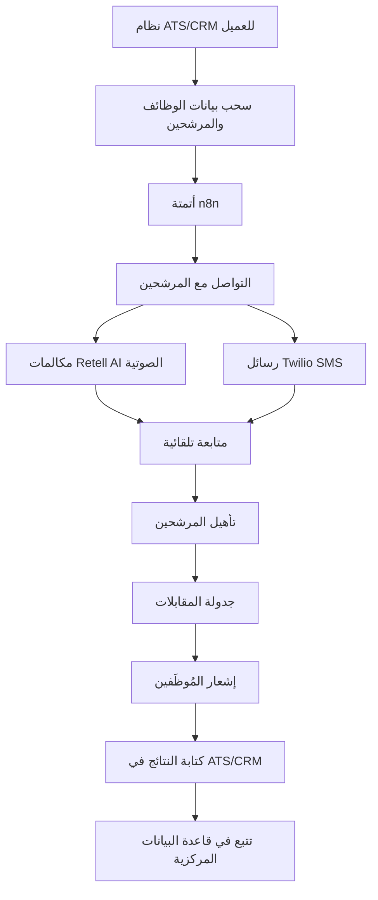
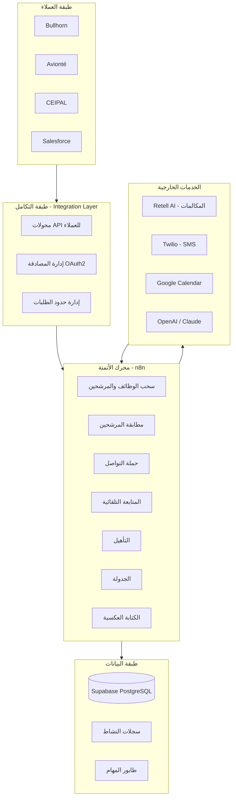
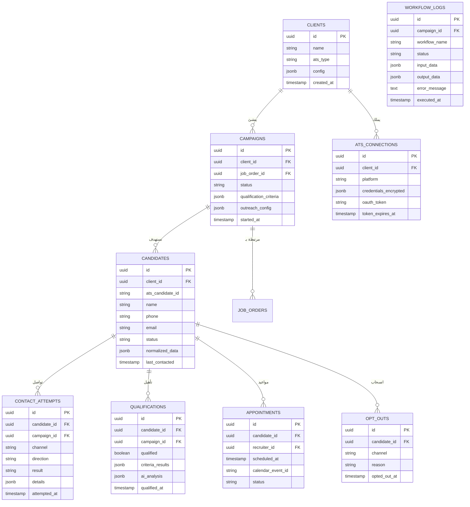
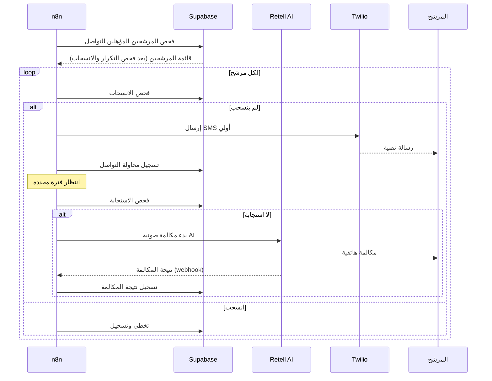
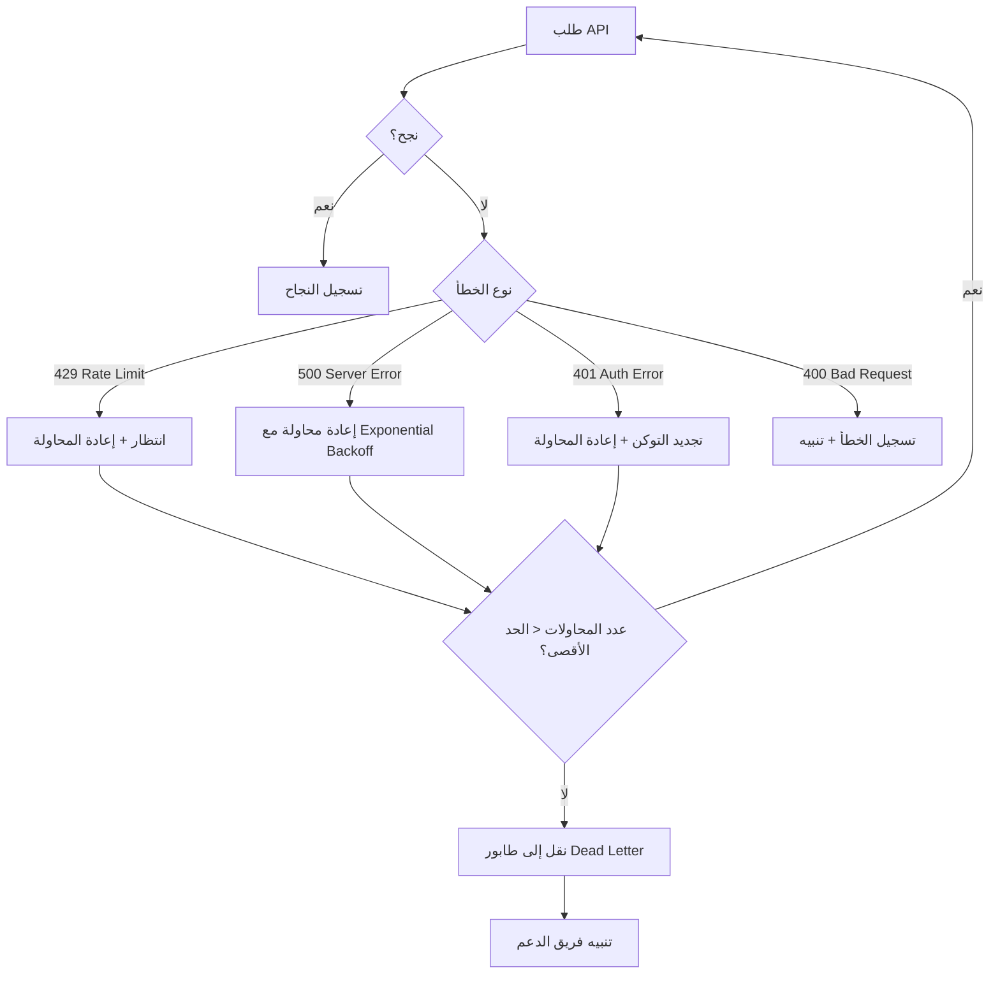
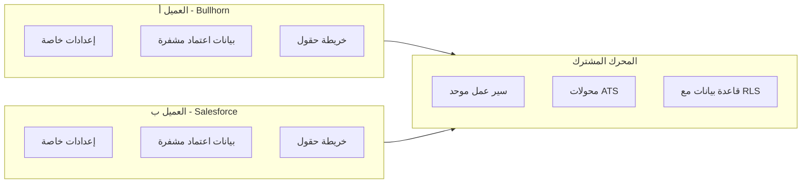

<div dir="rtl" align="right">

# 🏗️ محرك المرشحين - Stratton Candidate Engine

## خطة التنفيذ الشاملة

---

## ملخص المشروع

نظام أتمتة توظيف ذكي يربط بين أنظمة تتبع المتقدمين (ATS) وأنظمة إدارة علاقات العملاء (CRM) الخاصة بشركات التوظيف، ويُجري عمليات التواصل مع المرشحين تلقائيًا عبر المكالمات الصوتية بالذكاء الاصطناعي (Retell AI) والرسائل النصية (Twilio)، ثم يؤهل المرشحين ويحدد مواعيد المقابلات ويُعيد النتائج إلى نظام العميل.

> [!IMPORTANT]
> هذا المشروع ليس مجرد أتمتة بسيطة - إنه بنية تحتية إنتاجية قادرة على معالجة آلاف التفاعلات مع المرشحين بموثوقية عالية.

---

## 🔄 سير العمل الأساسي



---

## 🏛️ البنية المعمارية

### المكونات الرئيسية

| المكون | التقنية | الوظيفة |
|--------|---------|---------|
| محرك الأتمتة | n8n (مستضاف ذاتيًا) | تنسيق سير العمل وإدارة التدفقات |
| قاعدة البيانات المركزية | Supabase / PostgreSQL | تخزين الحالة والبيانات التشغيلية |
| المكالمات الصوتية AI | Retell AI | إجراء مكالمات صوتية ذكية للمرشحين |
| الرسائل النصية | Twilio | إرسال واستقبال SMS |
| جدولة المواعيد | Google Calendar / Microsoft 365 | حجز مواعيد المقابلات |
| واجهة الإدارة | Next.js + Supabase | لوحة تحكم لإدارة الحملات |
| الذكاء الاصطناعي | OpenAI / Claude APIs | تحليل المرشحين وتأهيلهم |
| الاستضافة | Docker + VPS | بيئة إنتاجية موثوقة |

---

### مخطط البنية المعمارية



---

## 📊 تصميم قاعدة البيانات

### الجداول الرئيسية



---

## 📁 هيكل المشروع المقترح

```
ERP_CRM/
├── 📂 docs/                          # التوثيق
│   ├── architecture.md               # وثيقة البنية المعمارية
│   ├── api-mappings/                  # خرائط حقول API لكل ATS
│   │   ├── bullhorn.md
│   │   ├── avionte.md
│   │   └── ceipal.md
│   ├── runbooks/                      # أدلة التشغيل
│   └── client-onboarding.md          # دليل إعداد عميل جديد
│
├── 📂 database/                       # مخططات قاعدة البيانات
│   ├── migrations/                    # هجرات قاعدة البيانات
│   │   ├── 001_create_clients.sql
│   │   ├── 002_create_campaigns.sql
│   │   ├── 003_create_candidates.sql
│   │   ├── 004_create_contact_attempts.sql
│   │   ├── 005_create_qualifications.sql
│   │   ├── 006_create_appointments.sql
│   │   ├── 007_create_opt_outs.sql
│   │   └── 008_create_workflow_logs.sql
│   ├── seeds/                         # بيانات تجريبية
│   └── functions/                     # دوال PostgreSQL
│       ├── check_duplicate_contact.sql
│       ├── check_opt_out.sql
│       └── update_campaign_stats.sql
│
├── 📂 n8n-workflows/                  # سير عمل n8n
│   ├── core/                          # الأساسية
│   │   ├── job-order-sync.json        # مزامنة طلبات التوظيف
│   │   ├── candidate-pull.json        # سحب المرشحين
│   │   ├── candidate-matching.json    # مطابقة المرشحين
│   │   └── ats-writeback.json         # الكتابة العكسية
│   ├── outreach/                      # التواصل
│   │   ├── sms-campaign.json          # حملة SMS
│   │   ├── voice-campaign.json        # حملة المكالمات
│   │   ├── follow-up-sequence.json    # سلسلة المتابعة
│   │   └── opt-out-handler.json       # معالج الانسحاب
│   ├── qualification/                 # التأهيل
│   │   ├── ai-qualification.json      # تأهيل بالذكاء الاصطناعي
│   │   └── criteria-evaluator.json    # تقييم المعايير
│   ├── scheduling/                    # الجدولة
│   │   ├── calendar-booking.json      # حجز المواعيد
│   │   └── recruiter-notification.json # إشعار المُوظِّفين
│   └── webhooks/                      # نقاط الاستقبال
│       ├── retell-callback.json       # استجابة Retell
│       ├── twilio-callback.json       # استجابة Twilio
│       └── ats-webhook.json           # استجابة ATS
│
├── 📂 integrations/                   # وحدات التكامل
│   ├── ats-adapters/                  # محولات ATS
│   │   ├── base-adapter.js            # المحول الأساسي
│   │   ├── bullhorn-adapter.js
│   │   ├── avionte-adapter.js
│   │   ├── ceipal-adapter.js
│   │   ├── recruit-crm-adapter.js
│   │   └── salesforce-adapter.js
│   ├── retell/                        # تكامل Retell AI
│   │   ├── agent-config.js            # إعداد وكيل المكالمات
│   │   ├── call-handler.js            # معالج المكالمات
│   │   └── prompts/                   # قوالب المحادثة
│   │       ├── initial-outreach.md
│   │       ├── follow-up.md
│   │       └── qualification.md
│   ├── twilio/                        # تكامل Twilio
│   │   ├── sms-handler.js
│   │   └── templates/                 # قوالب الرسائل
│   └── calendar/                      # تكامل التقويم
│       ├── google-calendar.js
│       └── microsoft-365.js
│
├── 📂 services/                       # الخدمات الخلفية
│   ├── auth/                          # المصادقة
│   │   ├── oauth2-manager.js
│   │   └── secrets-manager.js
│   ├── queue/                         # إدارة الطوابير
│   │   ├── task-queue.js
│   │   └── retry-handler.js
│   ├── dedup/                         # منع التكرار
│   │   └── dedup-service.js
│   └── monitoring/                    # المراقبة
│       ├── health-check.js
│       └── alert-service.js
│
├── 📂 dashboard/                      # لوحة التحكم
│   ├── src/
│   │   ├── app/
│   │   ├── components/
│   │   └── lib/
│   ├── package.json
│   └── next.config.js
│
├── 📂 config/                         # الإعدادات
│   ├── client-template.yaml           # قالب إعداد عميل
│   ├── qualification-templates/       # قوالب التأهيل
│   └── outreach-templates/            # قوالب التواصل
│
├── 📂 scripts/                        # سكريبتات مساعدة
│   ├── setup-client.sh                # إعداد عميل جديد
│   ├── test-integration.sh            # اختبار التكامل
│   └── migrate-db.sh                  # تشغيل هجرات DB
│
├── 📂 tests/                          # الاختبارات
│   ├── integration/
│   ├── unit/
│   └── e2e/
│
├── docker-compose.yml                 # إعداد Docker
├── .env.example                       # نموذج المتغيرات البيئية
├── package.json
└── README.md
```

---

## 🔧 التفاصيل التقنية لكل مكون

### 1️⃣ طبقة التكامل مع ATS/CRM

#### نمط المحول (Adapter Pattern)

كل نظام ATS له محول خاص يُنفذ واجهة موحدة:

```javascript
// base-adapter.js - الواجهة الأساسية
class BaseATSAdapter {
    async authenticate()          // المصادقة OAuth2
    async getJobOrders(filters)   // جلب طلبات التوظيف
    async getCandidates(query)    // جلب المرشحين
    async updateCandidate(id, data) // تحديث بيانات مرشح
    async addNote(candidateId, note) // إضافة ملاحظة
    async getFieldMappings()      // خريطة الحقول
    normalizeCandidate(raw)       // تطبيع البيانات
}
```

> [!TIP]
> نمط المحول يسمح بإضافة أنظمة ATS جديدة بدون تغيير المنطق الأساسي - فقط أنشئ محولًا جديدًا!

#### إدارة المصادقة

```javascript
// OAuth2 Flow
// 1. العميل يمنح الصلاحيات عبر OAuth2 Authorization Code
// 2. نخزن tokens مشفرة في Supabase
// 3. نجدد التوكن تلقائيًا قبل انتهائه
// 4. Secrets تُدار عبر متغيرات بيئية مشفرة
```

---

### 2️⃣ محرك الأتمتة (n8n)

#### تقسيم المسؤوليات

| في n8n ✅ | في قاعدة البيانات ✅ |
|-----------|---------------------|
| تنسيق سير العمل | حالة الحملة |
| استدعاء APIs | سجل محاولات التواصل |
| معالجة Webhooks | نتائج التأهيل |
| منطق التوجيه | قائمة المنسحبين |
| إدارة إعادة المحاولات | تخطيط الحقول |
| الإشعارات | بيانات المرشحين المُطبّعة |
| تحويل البيانات | سجلات النشاط |

#### سير عمل حملة التواصل



---

### 3️⃣ معالجة الأخطاء وإعادة المحاولات



#### استراتيجية إعادة المحاولات

```javascript
const retryConfig = {
    maxRetries: 3,
    initialDelay: 1000,      // 1 ثانية
    maxDelay: 30000,          // 30 ثانية
    backoffMultiplier: 2,     // مضاعفة التأخير
    retryableErrors: [429, 500, 502, 503, 504],
    nonRetryableErrors: [400, 401, 403, 404]
};
```

---

### 4️⃣ منع التواصل المُكرر

```sql
-- دالة PostgreSQL لفحص التكرار
CREATE OR REPLACE FUNCTION check_duplicate_contact(
    p_candidate_id UUID,
    p_campaign_id UUID,
    p_channel VARCHAR,
    p_cooldown_hours INTEGER DEFAULT 24
) RETURNS BOOLEAN AS $$
DECLARE
    last_attempt TIMESTAMP;
BEGIN
    -- فحص الانسحاب أولاً
    IF EXISTS (
        SELECT 1 FROM opt_outs 
        WHERE candidate_id = p_candidate_id
    ) THEN
        RETURN FALSE;
    END IF;
    
    -- فحص آخر محاولة تواصل
    SELECT MAX(attempted_at) INTO last_attempt
    FROM contact_attempts
    WHERE candidate_id = p_candidate_id
      AND campaign_id = p_campaign_id
      AND channel = p_channel;
    
    -- السماح بالتواصل فقط بعد فترة التبريد
    IF last_attempt IS NOT NULL 
       AND last_attempt > NOW() - (p_cooldown_hours || ' hours')::INTERVAL 
    THEN
        RETURN FALSE;
    END IF;
    
    RETURN TRUE;
END;
$$ LANGUAGE plpgsql;
```

#### مفتاح Idempotency

```javascript
// كل عملية تواصل لها مفتاح فريد
const idempotencyKey = crypto.createHash('sha256')
    .update(`${campaignId}:${candidateId}:${channel}:${sequenceStep}`)
    .digest('hex');

// يُخزن في قاعدة البيانات لمنع التنفيذ المزدوج
```

---

### 5️⃣ بنية متعددة العملاء (Multi-Tenant)



#### فصل البيانات باستخدام Row Level Security

```sql
-- سياسة أمان على مستوى الصف
ALTER TABLE candidates ENABLE ROW LEVEL SECURITY;

CREATE POLICY client_isolation ON candidates
    USING (client_id = current_setting('app.current_client_id')::UUID);

-- كل استعلام يرى فقط بيانات العميل المحدد
```

#### إعداد عميل جديد

```yaml
# config/client-template.yaml
client:
  name: "اسم الشركة"
  ats:
    platform: "bullhorn"  # bullhorn | avionte | ceipal | salesforce
    api_url: "https://rest.bullhornstaffing.com"
    credentials:
      client_id: "${ENCRYPTED}"
      client_secret: "${ENCRYPTED}"
    field_mappings:
      candidate_name: "firstName,lastName"
      phone: "phone"
      email: "email"
      skills: "skillList"
      
  outreach:
    sms:
      enabled: true
      template: "initial-outreach"
      follow_up_delay_hours: 4
    voice:
      enabled: true
      retell_agent_id: "agent_xxx"
      follow_up_delay_hours: 24
      
  qualification:
    criteria:
      - field: "experience_years"
        operator: ">="
        value: 2
      - field: "location_radius_miles"
        operator: "<="
        value: 50
      - field: "availability"
        operator: "in"
        value: ["immediate", "2_weeks"]
        
  scheduling:
    calendar_type: "google"  # google | microsoft
    recruiter_calendars:
      - recruiter_id: "rec_001"
        calendar_id: "calendar@company.com"
        specialties: ["IT", "Engineering"]
```

---

## 📋 مراحل التنفيذ

### المرحلة الأولى: الأساس (الأسبوع 1-2)

- [ ] إعداد بيئة التطوير (Docker, n8n, Supabase)
- [ ] إنشاء مخطط قاعدة البيانات وتشغيل الهجرات
- [ ] بناء المحول الأساسي (Base Adapter)
- [ ] إعداد نظام إدارة الأسرار والمصادقة
- [ ] إعداد سير عمل n8n الأساسي

### المرحلة الثانية: التكامل مع ATS (الأسبوع 3-4)

- [ ] بناء أول محول ATS (Bullhorn أو حسب العميل الأول)
- [ ] سير عمل سحب الوظائف والمرشحين
- [ ] تطبيع البيانات وتخطيط الحقول
- [ ] سير عمل الكتابة العكسية

### المرحلة الثالثة: التواصل (الأسبوع 5-6)

- [ ] تكامل Twilio SMS (إرسال/استقبال)
- [ ] تكامل Retell AI (مكالمات صوتية)
- [ ] معالج الانسحاب الفوري
- [ ] سلسلة المتابعة التلقائية
- [ ] منع التواصل المُكرر

### المرحلة الرابعة: التأهيل والجدولة (الأسبوع 7-8)

- [ ] منطق تأهيل المرشحين بالذكاء الاصطناعي
- [ ] تكامل Google Calendar / Microsoft 365
- [ ] جدولة المقابلات التلقائية
- [ ] إشعارات المُوظِّفين

### المرحلة الخامسة: المراقبة والإنتاج (الأسبوع 9-10)

- [ ] لوحة تحكم الإدارة
- [ ] نظام المراقبة والتنبيهات
- [ ] اختبارات التكامل الشاملة
- [ ] توثيق النظام
- [ ] إعداد بيئة الإنتاج

### المرحلة السادسة: التوسع (الأسبوع 11-12)

- [ ] بنية متعددة العملاء كاملة
- [ ] محولات ATS إضافية
- [ ] قوالب سير عمل قابلة لإعادة الاستخدام
- [ ] دليل إعداد عميل جديد

---

## 🛡️ الأمان وأفضل الممارسات

### إدارة الأسرار
- جميع بيانات الاعتماد مشفرة في قاعدة البيانات
- استخدام متغيرات بيئية للمفاتيح الحساسة
- لا تُخزن الأسرار في الكود المصدري أبدًا

### أمان Webhooks
- التحقق من توقيعات Webhook
- قائمة بيضاء لعناوين IP
- تشفير HTTPS لجميع الاتصالات

### حدود الطلبات
- احترام حدود API لكل منصة
- طابور ذكي لتوزيع الطلبات
- تخزين مؤقت للبيانات المتكررة

---

## ✅ خطة التحقق

### الاختبارات الآلية
```bash
# اختبارات الوحدة
npm run test:unit

# اختبارات التكامل
npm run test:integration

# اختبارات من طرف لطرف
npm run test:e2e
```

### التحقق اليدوي
- اختبار سير العمل الكامل مع بيانات تجريبية
- محاكاة سيناريو 20,000 مرشح
- اختبار الانسحاب الفوري
- اختبار فشل API وإعادة المحاولات
- اختبار فصل بيانات العملاء

---

## 🔑 مراجعة المستخدم مطلوبة

> [!IMPORTANT]
> **قبل البدء في التنفيذ، نحتاج إلى تأكيد النقاط التالية:**

### أسئلة مفتوحة

1. **أي نظام ATS هو الأول؟** - ما هو النظام الذي يستخدمه العميل الأول (Bullhorn, Avionté, CEIPAL, إلخ)؟ هذا سيحدد أي محول نبنيه أولاً.

2. **بيئة الاستضافة** - هل تفضل استضافة ذاتية (VPS/Docker) أم خدمات سحابية (AWS/GCP)؟

3. **لوحة التحكم** - هل نحتاج لوحة تحكم ويب في المرحلة الأولى أم يكفي n8n + Supabase Dashboard؟

4. **نطاق الإطلاق الأول** - هل نبدأ بعميل واحد محدد أم نبني بنية متعددة العملاء من اليوم الأول؟

5. **قوالب الرسائل والمكالمات** - هل لديكم قوالب جاهزة لنصوص SMS ومحادثات AI Voice أم نحتاج لإنشائها؟

6. **معايير التأهيل** - هل معايير تأهيل المرشحين موحدة أم تختلف حسب نوع الوظيفة والعميل؟

---

> [!NOTE]
> هذه الخطة مصممة لتكون **معيارية وقابلة للتوسع**. يمكن البدء بالأساسيات ثم إضافة المكونات تدريجيًا. الهدف هو بناء **محرك قابل لإعادة الاستخدام** وليس حلاً مخصصًا لعميل واحد.

</div>
